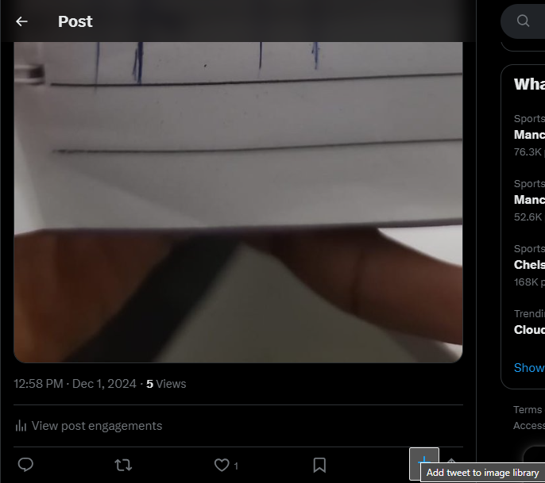
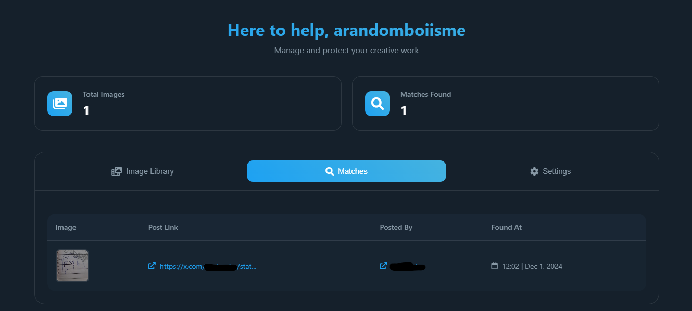

## Update

Google approved the extension. You can [download it](https://chromewebstore.google.com/detail/tweet-patrol/jkdbpcgpokfgfaekhmjhlbbkfckidgpk?hl=en&authuser=0) from the Chrome Web Store.

## Quick overview

Basically, I saw this comment under a post about a stolen image repost and decided to embark on this project:

One month later, and here we are lol.

The extension works like this:
- Users register images they want to track
    - Images are added by clicking on a button that will be injected to the X frontend by the extension. This button will only be visible to registered users.
    
    
- Other extension users simply use X/Twitter as they normally would
- Any occurence of registered images that have not been posted by the registrar will be flagged as "stolen", with a banner popup on the X frontend and all. Like this (peep my drawing skills btw):

    

The registrar also sees stolen image matches on their dashboard (I forgot to mention the dashboard), like this:

I have some more features in mind, but this is all for now.

## Installation

- Download this project as a ZIP file
- Unzip the file
- Navigate to your browser's extension page:
    - For Chrome: chrome://extensions/
    - For Edge: edge://extensions/
- Load the unzipped project as an unpacked extension

## Complaints/Feedback

Submit all your complaints to [this repo's issues page](https://github.com/ARandomBoiIsMe/TweetPatrol/issues). Feedback, suggestions and/or questions? [DM me on X](https://x.com/arandomboiisme)